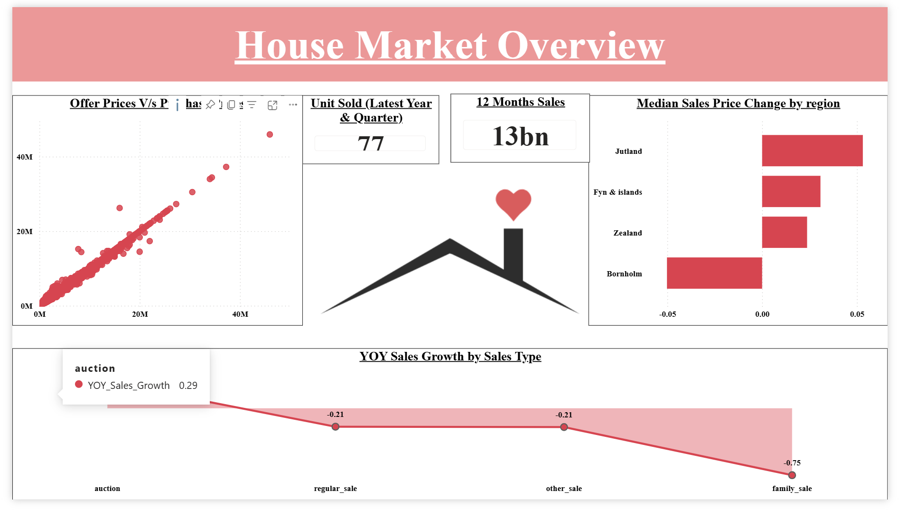
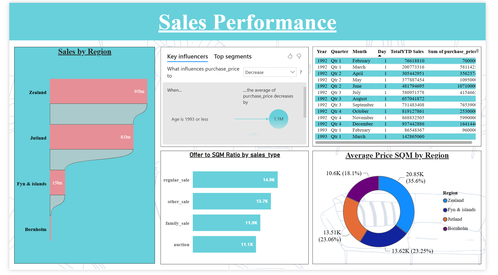
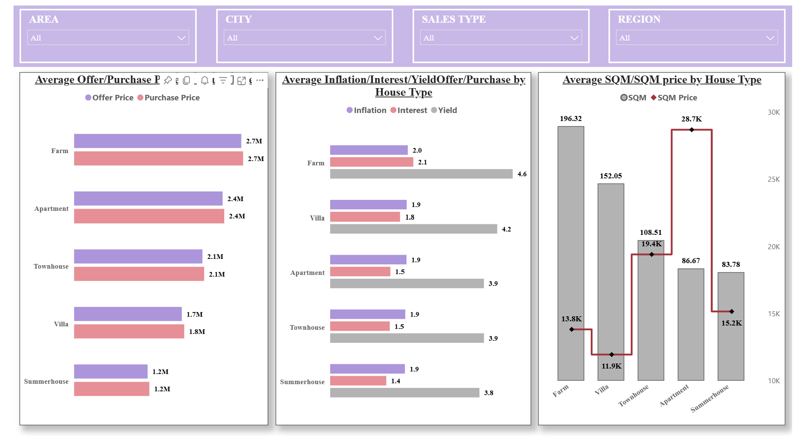

# 🏠 House Market & Sales Performance Analysis

[](#)
[](#)
[](#)
[](#)

---

### Dashboard Link: [Insert Your Power BI Public/Service Link Here]

---

## Problem Statement

Real estate management needed an end-to-end analytics platform to track housing purchase performance, median property pricing, year-over-year sales growth, regional market distribution, and square-metre price valuations across 100,000 transaction records.

By processing housing data through Google BigQuery SQL queries and Power BI DAX calculations, this interactive multi-page dashboard enables stakeholders to identify high-performing geographic regions, track pricing fluctuations, evaluate sales volume trends, and optimize real estate pricing strategies.

---

## Data Analytics Workflow
Housing Dataset ──► Google BigQuery (SQL Queries) ──► Power BI Data Connection ──► DAX Modeling & Measures ──► Multi-Page Interactive Dashboard ──► Business Insights

---

## Steps Followed

- Step 1: Uploaded the **Housing** dataset (100,000 rows × 21 columns) to Google BigQuery and generated a replica test environment table for preliminary querying[cite: 4].
- Step 2: Executed SQL data manipulation queries in BigQuery to calculate average purchase prices by `sales_type`, group regional metrics, and update property square-metre values dynamically based on room counts[cite: 4]:
  ```sql
  CREATE TABLE housing_test AS SELECT * FROM housing_data;
  
  SELECT sales_type, AVG(purchase_price) AS avg_price 
  FROM housing_data 
  GROUP BY sales_type;
  ```[cite: 4]
- Step 3: Connected Google BigQuery directly to Power BI Desktop to load the processed dataset[cite: 4].
- Step 4: Developed advanced DAX measures to build time-intelligence and outlier-resistant analytical metrics[cite: 4]:
  - **YOY Sales Growth**: `YOY Sales Growth = DIVIDE([Current Year Sales] - [Previous Year Sales], [Previous Year Sales], 0)`[cite: 4]
  - **YOY Median Sales Price**: Used `MEDIAN()` instead of average to eliminate extreme real estate price outliers[cite: 4].
  - **Last 12 Months Sales**: `L12M Sales = CALCULATE([Total Sales], DATESINPERIOD('Date'[Date], MAX('Date'[Date]), -12, MONTH))`[cite: 4]
  - **YTD Sales**: `YTD Sales = TOTALYTD([Total Sales], 'Date'[Date])`[cite: 4]
  - **Sales by Region**: `Sales By Region = CALCULATE([Total Sales], ALLEXCEPT('Housing', 'Housing'[Region]))`[cite: 4]
- Step 5: Modeled calculated columns for detailed property profiling[cite: 4]:
  - **Offer Price**: Estimated original listing values from percentage change metrics[cite: 4].
  - **Property Age**: Derived from transaction dates and construction year fields[cite: 4].
  - **Offer-to-SQM Ratio**: Evaluated pricing efficiency per unit area using `DIVIDE()`[cite: 4].
- Step 6: Designed a 3-page interactive Power BI report covering **House Market Overview**, **Sales Performance**, and **House Type Analysis**, incorporating Key Influencers visuals to highlight price drivers[cite: 4].

---

## Key Dashboard Visuals & Findings

- Page 1 – House Market Overview[cite: 4]:
  - Macro market metrics, overall housing sales KPIs, regional price distributions, and interactive filter slicers[cite: 4].
- Page 2 – Sales Performance[cite: 4]:
  - Temporal sales performance trends, YOY growth rates, regional category benchmarks, and rolling 12-month metrics[cite: 4].
- Page 3 – House Type Analysis[cite: 4]:
  - Property classification breakdown, square-metre pricing correlations, and property characteristic comparisons[cite: 4].

---

# Snapshot of Dashboard

### Page 1 – House Market Overview


### Page 2 – Sales Performance


### Page 3 – House Type Analysis


---

# Key Insights

* **Outlier-Resistant Valuation**: Utilizing median sales price metrics provided a clearer representation of typical market values by removing the distorting effects of luxury real estate outliers[cite: 4].
* **Regional Market Concentration**: Certain regions consistently generate higher transaction volumes, allowing sales teams to target high-demand geographical areas[cite: 4].
* **Pricing Efficiency**: Evaluating price per square metre across property types revealed optimal value segments for prospective buyers and sellers[cite: 4].
* **Time-Series Growth**: Year-over-year and YTD performance metrics highlight peak transaction seasons, assisting in revenue forecasting[cite: 4].


